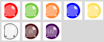
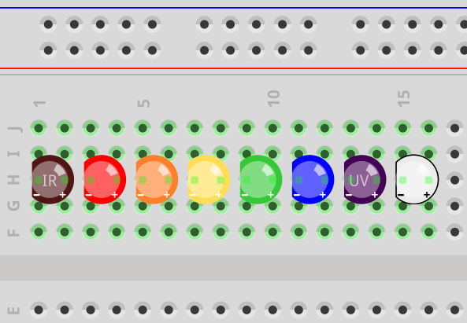
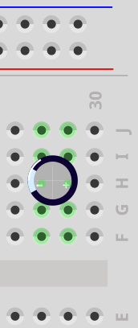
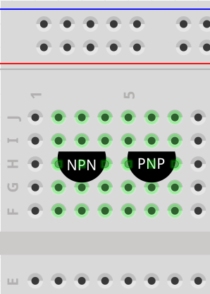

# fritzing-parts

This repository contains Fritzing parts that are needed to follow the examples on https://roboter-basteln.de/.

These parts might not integrate with other parts very well, e.g. I have noticed that the top view capacitor may change to a side view capacitor, because it somehow merges with existing capacitors. Also, I don't know how to make the capacitance changeable.

## Top views

You'll find LEDs, transistors and capacitors in top view, so that they take less space on the breadboard. This is supposed to make it more comparable to photos taken from above.

  
  